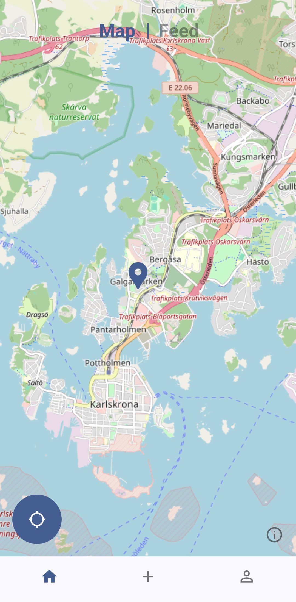

# Hidden gem



## Table of contents
1. [Introduction](#introduction)
1. [Requirements](#requirements)
1. [Build instructions](#build-instructions)
1. [Technologies used](#technologies-used)
1. [Acceptance tests](#acceptance-tests)

## Introduction
A PA1414 project

Hidden Gem is a mobile app that lets users discover, save, and share interesting locations. Users can post "gems", explore a map, and interact with other users through likes and comments.

## Requirements
This project was designed to meet the following requirements:
- Map & Location
  - An interactive map where users can explore and save locations.
  - A feed where users can discover spots.
- Add New Gems
  - Give the place a name and short description.
  - Upload one or more photos (from camera or gallery).
  - Save the exact location (latitude and longitude).
- Social Features
  - Like and comment on other users' gems.
  - Follow users to keep up with their discoveries.

And non functional requirements:
- The app should be easy to use, with a clean and intuitive interface.
- The system should respond to a user action within a few seconds.
- All user data should be stored securely and all passwords should be hashed.
- The app should be compatible with iOS and Android
- The app should only allow authorized users, via tokens, to access and edit personal data
- The system should ensure high availability and minimal downtime.
- The app should follow best practices to support a wide range of users.

## Build instructions
This project requires the following applications with versions:
- Flutter: 3.35.3
- Dart: 3.9.2

It may work with later versions, but these are the versions it was tested with.

You will need either an Android or iOS device to run this project.
You can also use an emulator (Android or iOS), though iOS emulation only works on macOS.

---

### Running automatically
To quickly build and deploy on a device you can run this command:
```shell
$ flutter run
```

### Manual build steps
If you prefer to build and install manually, use the following steps:

#### 1. Installing dependencies
```shell
$ flutter pub get
```

#### 2. Building release
```shell
$ flutter build apk
```

#### 3. Installing to device
If you have a device connected to your computer, run:
```shell
$ flutter install
```
> Note: This can be either Android or iOS, emulated or physical. However, this has not been tested on iOS.

## Technologies used
- Flutter (UI framework)
- Dart (programming language)
- Firebase (authentication, database, and storage)

## Acceptance tests
The following acceptance tests have been implemented:

- [x] 1. Registration & Login (email/password) or Social Login (Google/Facebook)
- [x] 2. Interactive Map Display
- [x] 3. Create New “Gem” – Basic Data
- [x] 4. Create New “Gem” – Photo(s)
- [x] 5. Create New “Gem” – Exact Position
- [x] 6. My Profile – Own Gems
- [x] 7. Delete Own Gem
- [x] 8. Feed – Friends’ Gems
- [x] 9. Follow Users
- [x] 10. Like
- [x] 11. Invite via Email
- [x] 12. Access Control – Private Data
- [x] 13. Access Control – Publicly Shared Gems
- [x] 14. Secure Password Storage
- [x] 15. Image Storage & Access Rights
- [x] 16. Database Rules
- [x] 17. Error Handling – Network Failure
- [x] 18. Filter Gems
- [x] 19. Grouping of Gems
- [x] 20. Performance – Map View
- [x] 21. Profile – Editing
- [x] 22. Report Inappropriate Content (Basic Level)
- [x] 23. Comment
- [x] 24. Allow Location Access
- [x] 25. Password Reset